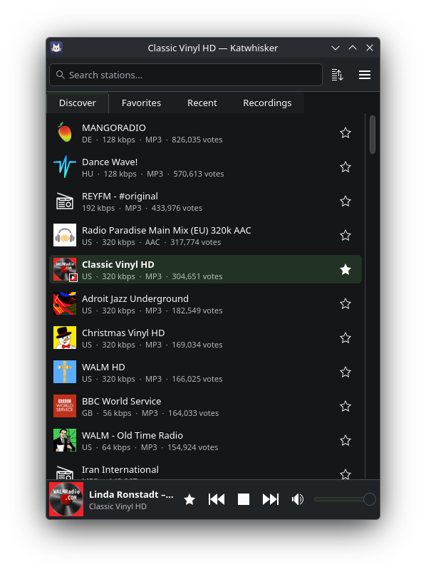

# Katwhisker

A small web radio player for KDE Plasma, using the [radio-browser.info](https://www.radio-browser.info/) station directory.

<p align="center"></p>

## Building

Needs Qt 6 (including Multimedia), KDE Frameworks 6 (Kirigami, CoreAddons, I18n), Kirigami Addons and Extra CMake Modules.

```sh
cmake -B build
cmake --build build
./build/bin/katwhisker
```

## License

Code is GPL-3.0-or-later, the icon CC-BY-SA-4.0. Song recording is meant for personal use; respect the stations' terms.
